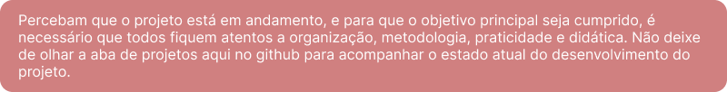

 <!-- SEPARADOR -->

    

 <!-- SEPARADOR -->

Bem-vindo(a) ao projeto **TheGuideForYou**, um projeto criado com a função de documentar todas as linguagens possíveis na criação de bots para Discord. Se você está procurando uma documentação global, que contém todos os guias reunidos em um único lugar, você está no projeto certo.

Desse modo, o principal objetivo dessa documentação é reunir todos os programadores/desenvolvedores com capacidade e conhecimento nas linguagens contidas nesse guia, sempre com o foco em criar passos detalhados e explicativos de como desenvolver o bot naquela linguagem. Toda e qualquer alteração irá ser revisada pela equipe responsável, trazendo o guia mais completo e definitivo da internet.

Bom, se você chegou nessa parte, fique sabendo que estamos muito animados por você querer contribuir para este projeto. É muito importante para nós que haja o máximo de pessoas com a iniciativa de contribuir e ajudar o próximo, até porque foi com essa ideia que o guia surgiu. Se você tem qualquer conhecimento, não importa a quantidade, se você acha que com o conhecimento que você tem, conseguirá fazer a diferença (mesmo que seja mínima), sinta-se em casa, a vontade, e pode ter certeza que iremos recebê-lo com toda gratidão.

Não poderiamos deixar de mostrar nossa gratidão para todos os contribuidores do projeto TheGuideForYou.

