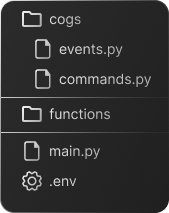

# Estruturando o projeto

Agora precisamos criar uma estrutura para o projeto, definir onde vão ficar os eventos, os comandos e outras funções relacionadas ao bot.

### Estrutura de arquivos

### Descrição dos diretórios

  \
  `main.py` será o arquivo principal, onde definimos o `client` e iniciamos o bot, também será usado para carregar outros arquivos do projeto.

  \
  Cogs são extensões do discord.py. Cada cog é um módulo Python que contém um conjunto de comandos, listeners de eventos e/ou outras funcionalidades.

  \
  A pasta `functions/` pode conter arquivos com funções auxiliares indiretas, que serão usadas em um ou vários arquivos da aplicação.
  
  \
  `.env` é usado para armazenar variáveis de ambiente de forma segura, como o token do bot e outras credenciais privadas.

